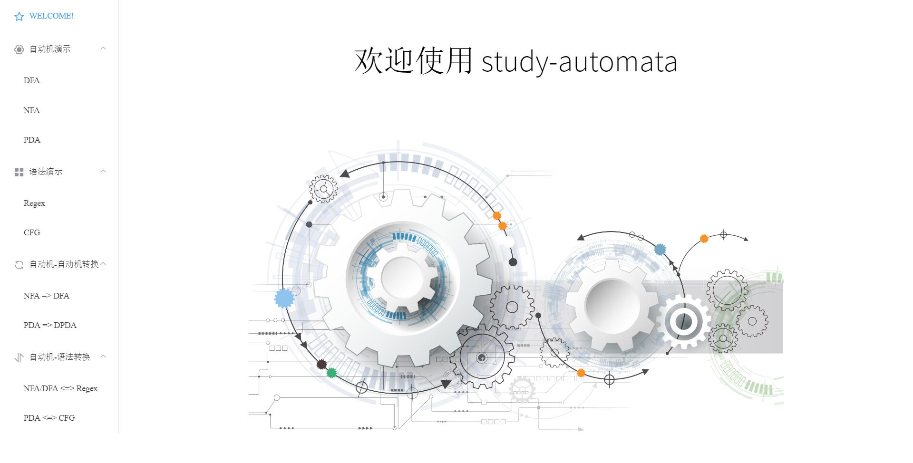

# study-automata

A visualized software for studying automata theory.

The software is bound for teachers and students to use as a reference for the aquisition of [automata theory](https://en.wikipedia.org/wiki/Automata_theory).



## Authors:
* Zongxing Wei https://github.com/RuMaxwell
* Wenbo Shi https://github.com/Swenb

## Languages:
* Chinese
* English (future)

## algorithm:
You can see the core algorithm without gui in https://github.com/RuMaxwell/study-automata

## Features
* **Automata simulation** (produce result, and step-by-step demonstration)
  * [DFA](https://en.wikipedia.org/wiki/Deterministic_finite_automaton) simulator
  * [NFA](https://en.wikipedia.org/wiki/Nondeterministic_finite_automaton) simulator
  * [PDA](https://en.wikipedia.org/wiki/Pushdown_automaton) simulator
  * [Regex](https://en.wikipedia.org/wiki/Regular_expression) (Regular expressions) calculator
  * [CFG](https://en.wikipedia.org/wiki/Context-free_grammar) calculator
* **Automata conversion**
  * DFAs <= NFAs
  * DFAs <= ε-NFAs
  * DPDAs <= PDAs
* **Automata-Grammar conversion**
  * D/NFAs <=> Regexes
  * DPDAs <=> CFG
* **Simulate the Pumping Lemma**

## How to use
The project is still under construction, which means there is no released version so far.

## For developers

``` bash
# install dependencies
npm install

# serve with hot reload at localhost:9080
npm run dev

# build electron application for production
npm run build


# lint all JS/Vue component files in `src/`
npm run lint

```

This project was generated with [electron-vue](https://github.com/SimulatedGREG/electron-vue)@[7c4e3e9](https://github.com/SimulatedGREG/electron-vue/tree/7c4e3e90a772bd4c27d2dd4790f61f09bae0fcef) using [vue-cli](https://github.com/vuejs/vue-cli). Documentation about the original structure can be found [here](https://simulatedgreg.gitbooks.io/electron-vue/content/index.html).
